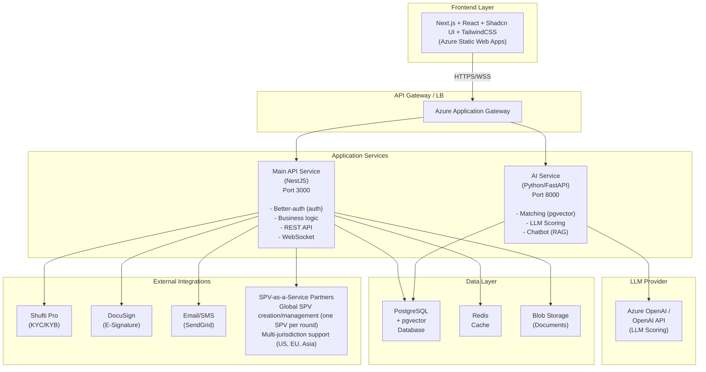

# Technical Specification: System Architecture Overview

**1. Overview**

- ID: ARCH-SYS-001
- Version: 2.0
- Date: 2025-01-17
- Author(s): Technical Architecture Team
- Goal/Objective: Define the high-level system architecture for the NartaQ MVP, outlining the service-oriented approach, pgvector-based matching system, SPV-as-a-Service integration, LLM-based AI scoring, and technology stack for connecting founders in emerging markets with global investors.

**2. Architecture Principles**

- **Service-Oriented Architecture**: Two main services (Main API, AI Service) for modularity and independent scaling
- **API-First Design**: All inter-service communication through well-defined REST APIs with OpenAPI specifications
- **Cloud-Native**: Leverage Azure PaaS services for scalability, reliability, and managed infrastructure
- **Security by Default**: Integrated authentication/authorization, encryption in transit and at rest
- **Data Consistency**: Single source of truth in centralized PostgreSQL database with proper transaction management
- **Observability**: Comprehensive logging, monitoring, and distributed tracing across all services
- **Pragmatic AI Matching**: pgvector-based similarity search on existing database infrastructure
- **Cost Efficiency**: Optimize for minimal incremental infrastructure cost

**2.1 Core Differentiators**

- **Pragmatic Matching System**: pgvector-based similarity search on existing PostgreSQL infrastructure, 70-80% accuracy, <100ms search latency
- **SPV-as-a-Service Integration**: One SPV per funding round via global partners, automated creation, clean cap tables (company has 1 shareholder per round: the SPV)
- **LLM-Based Scoring**: GPT-4o-mini structured prompts for investment readiness (not traditional ML), 30-60s scoring time
- **8-Layer Governance Protection**: Constitutional safeguards, weighted voting, multi-sig, time locks, AI fraud detection, legal backstop
- **Zero-Knowledge Security**: Private keys in FileSystemWallet (not database), government-proof design

**3. System Components**

### 3.1 Frontend Layer

- **Technology**: Next.js 15 with React 19, TypeScript
- **UI Framework**: Shadcn UI components with Tailwind CSS
- **State Management**:
  - React Query (TanStack Query) for server state
  - Zustand for client-side state
- **Authentication**: Better-auth client SDK (integrated with Main API)
- **Deployment**: Azure Static Web Apps or App Service
- **Responsibilities**:
  - User interface rendering
  - Client-side validation
  - API consumption
  - Real-time updates via WebSocket

### 3.2 Main API Service

- **Technology**: Node.js with NestJS framework
- **Port**: 3000 (configurable)
- **Database**: PostgreSQL (primary data store)
- **Authentication**: Better-auth library (integrated)
- **Responsibilities**:
  - User registration and login
  - Session management (Redis-backed)
  - JWT token issuance and validation
  - User onboarding (Founder/Investor)
  - Profile management
  - KYC/KYB verification orchestration
  - Marketplace browsing and search
  - Connection workflow management
  - Data room management
  - Guided close orchestration
  - Deal tracking and dashboard
  - Notification dispatch
  - Integration with external services (KYC, E-Signature)

### 3.3 AI Service

- **Technology**: Python with FastAPI
- **Port**: 8000 (configurable)
- **LLM Integration**: GPT-4o-mini via Azure OpenAI (preferred for data privacy) or OpenAI API
- **Vector Search**: PostgreSQL pgvector extension on existing database
- **Embedding Model**: BGE-small-en-v1.5 (384 dimensions, CPU-only)
- **Responsibilities**:
  - **Startup Matching**: pgvector-based similarity search
    - Single embedding model (BGE-small-en-v1.5) for vector generation
    - Cosine similarity search using HNSW index
    - Search latency: <100ms end-to-end
    - Match relevance: 70-80% accuracy
    - Rate limit: 500 requests/minute per user
  - **Investment Readiness Scoring**: LLM-based scoring with structured prompts
    - 6 scoring dimensions: Founder DNA, Business Model, Market, Team, Traction, Recommendations
    - GPT-4o-mini with temperature 0.3 for consistency
    - Pydantic validation for structured output
    - Cost: $0.10-0.15 per score, Time: 30-60 seconds
  - **Investor Recommendations**: Match investors to startups based on vector similarity
  - **Context-Aware Chatbot**: RAG-based chatbot for 3 stages (pre-deal, deal, post-deal)
  - **Anomaly Detection**: Fraud detection for DAO governance (Phase 2)

### 3.4 Data Layer

- **Primary Database**: Azure Database for PostgreSQL (Flexible Server)
  - Version: PostgreSQL 15+
  - Extensions: pgvector for vector similarity search
  - High availability: Zone-redundant
  - Backup: Automated daily with 7-day retention
- **Cache Layer**: Azure Cache for Redis
  - Session storage
  - Rate limiting
  - Hot data caching
- **Object Storage**: Azure Blob Storage
  - Document storage (pitch decks, legal documents)
  - Profile images
  - Data room files
  - Versioning enabled

### 3.5 Integration Layer

- **KYC/KYB Provider**: Shufti Pro API integration
  - Identity verification (KYI for investors)
  - Business verification (KYB for founders)
  - AML screening
  - Webhook callbacks for status updates
- **E-Signature Provider**: DocuSign API integration
  - Document signing workflows
  - Signature validation
  - Document archival
  - Webhook callbacks for signature events
- **SPV-as-a-Service Partners**: Global SPV creation and management
  - Automated SPV creation on round close (one SPV per round)
  - Clean cap table: company has 1 shareholder per round (the SPV)
  - No SPV board representative needed
  - Multi-jurisdiction support (US, EU, Asia)
  - 1-click legal automation
  - Webhook callbacks for SPV status updates

**4. Architecture Diagram**



**5. Data Flow Patterns**

### 5.1 Synchronous Request-Response

- User actions (CRUD operations)
- Real-time validation
- Immediate feedback required
- Protocol: REST over HTTPS

### 5.2 Asynchronous Processing

- AI scoring and matching (can take 5-30 seconds)
- KYC/KYB verification (external API calls)
- Document processing
- Email/SMS notifications
- Pattern: Job queue with status polling or webhooks

### 5.3 Event-Driven Updates

- Real-time notifications
- Connection status changes
- Document signature events
- Protocol: WebSocket or Server-Sent Events (SSE)

**6. Technology Stack Summary**

| Component | Technology | Version | Purpose |
|-----------|-----------|---------|---------|
| Frontend | Next.js | 15+ | Web application framework |
| Frontend UI | React | 19+ | UI library |
| Frontend Styling | TailwindCSS | 3.x | Utility-first CSS |
| Frontend Components | Shadcn UI | Latest | Pre-built components |
| Authentication | Better-auth (integrated) | Latest | Authentication/Authorization |
| Main API | NestJS | 10+ | Business logic API |
| AI Service | Python + FastAPI | 3.11+ | ML/AI operations |
| LLM Provider | Azure OpenAI / OpenAI | GPT-4o-mini | Structured prompts for scoring |
| Embedding Model | BGE-small-en-v1.5 | 384-dim | CPU-only text embeddings |
| Vector Search | PostgreSQL pgvector | Latest | Similarity search on existing database |
| Database | PostgreSQL | 15+ | Primary data store |
| Cache | Redis | 7.x | Session & caching |
| Object Storage | Azure Blob Storage | - | Document storage |
| Message Queue | Azure Service Bus | - | Async job processing |
| Monitoring | Azure Monitor + App Insights | - | Observability |
| KYC/KYB | Shufti Pro API | - | Identity/Business verification |
| E-Signature | DocuSign API | - | Document signing |
| SPV Partners | Multiple global providers | - | SPV-as-a-Service integration |

**7. Deployment Architecture**

### 7.1 Environment Strategy

- **Development**: Local Docker Compose
- **Staging**: Azure App Service (Standard tier)
- **Production**: Azure App Service (Premium tier) with auto-scaling

### 7.2 Service Deployment

```yaml
Main API Service:
  - Azure App Service (Linux)
  - Always On: enabled
  - Auto-scale: 3-10 instances
  - Health check: /health
  - Includes: Better-auth for authentication

AI Service:
  - Azure App Service (Linux) or Container Apps
  - Resources: 2 vCPU, 4GB RAM per instance
  - Auto-scale: 2-5 instances (CPU-based)
  - GPU: Not required (CPU-only)
  - Health check: /health
```

### 7.3 Database Deployment

- **PostgreSQL**: Azure Database for PostgreSQL Flexible Server
  - Compute: General Purpose (4 vCores, 16GB RAM)
  - Storage: 128GB with auto-growth
  - Backup: 7-day retention
  - High Availability: Zone-redundant
  - SSL: Required

### 7.4 CI/CD Pipeline

- **Source Control**: GitHub
- **CI/CD**: GitHub Actions
- **Build**: Docker images for all services
- **Registry**: Azure Container Registry
- **Deployment**: Rolling updates with health checks
- **Rollback**: Automatic on health check failure

**8. Security Architecture**

### 8.1 Authentication & Authorization

- JWT tokens with 1-hour expiry
- Refresh tokens with 7-day expiry (stored in Redis)
- RBAC (Role-Based Access Control)
  - Roles: Founder, Investor, Admin, SPV Partner
- API key authentication for service-to-service calls

### 8.2 Network Security

- All traffic over HTTPS (TLS 1.3)
- API Gateway with WAF (Web Application Firewall)
- DDoS protection at Application Gateway level
- Private endpoints for database and Redis
- VNet integration for services

### 8.3 Data Security

- Encryption at rest (Azure Storage Service Encryption)
- Encryption in transit (TLS 1.3)
- PII data encryption in database (column-level)
- Sensitive data masking in logs
- Key management via Azure Key Vault

### 8.4 Compliance

- GDPR compliance for EU users
- Data residency: EU West (primary), US East (secondary)
- Audit logging for all sensitive operations
- Right to erasure (GDPR Article 17)
- Data portability (GDPR Article 20)

**9. API Communication Patterns**

### 9.1 Inter-Service Communication

```typescript
// All services expose standardized endpoints
GET  /health          // Health check
GET  /metrics         // Prometheus metrics
POST /api/v1/*        // Business logic endpoints

// Authentication header (service-to-service)
Authorization: Bearer <JWT_SERVICE_TOKEN>
X-Service-Name: main-api
X-Request-ID: <uuid>

// Main API ↔ AI Service communication
POST /api/v1/matching/search
POST /api/v1/scoring/readiness
POST /api/v1/chatbot/query
```

### 9.2 Frontend-to-Backend Communication

```typescript
// User authentication
Authorization: Bearer <JWT_USER_TOKEN>
X-Request-ID: <uuid>
Content-Type: application/json
```

### 9.3 External Integration Communication

```typescript
// Standardized webhook handling
POST /webhooks/kyc/shufti
POST /webhooks/esign/docusign

Headers:
  X-Webhook-Signature: <HMAC>
  X-Webhook-ID: <uuid>
  Content-Type: application/json
```

**10. Service Degradation & Resilience Strategy**

### 10.1 Service Dependency Matrix

**Critical Dependencies:**

| Service | Depends On | Failure Impact | Degraded Mode Available |
|---------|-----------|----------------|------------------------|
| Frontend | Main API | Cannot load data | ✅ Show cached data + offline banner |
| Main API | PostgreSQL | Cannot read/write | ❌ Show maintenance page |
| Main API | Redis | Cannot cache/rate-limit | ✅ Degrade to in-memory cache |
| Main API | AI Service | Cannot generate scores/matches | ✅ Queue for async processing |
| AI Service | PostgreSQL | Cannot search vectors | ❌ Show maintenance page |
| AI Service | OpenAI API | Cannot score | ✅ Return cached scores + queue |

### 10.2 AI Service Degradation Strategy

**Scenario: AI Service Down (Complete Outage)**

Impact:
- Cannot generate new embeddings for matching
- Cannot run investment readiness scoring
- Cannot perform vector-based marketplace search
- Cannot provide founder guidance recommendations

Degraded Mode Behavior:

```typescript
// Main API: Detect AI service failure via circuit breaker
class AIServiceCircuitBreaker {
  private circuitBreaker: CircuitBreaker;
  
  constructor() {
    this.circuitBreaker = new CircuitBreaker(this.callAIService, {
      timeout: 10000, // 10s timeout
      errorThresholdPercentage: 50, // Open after 50% failures
      resetTimeout: 60000 // Retry after 1 minute
    });
    
    this.circuitBreaker.on('open', () => {
      logger.error('AI Service circuit breaker OPEN - Entering degraded mode');
      this.enableDegradedMode();
    });
  }
  
  private enableDegradedMode() {
    // 1. Show banner to users
    systemStatus.setDegradedMode('ai_service', {
      message: 'AI features temporarily unavailable. DNA generation queued.',
      severity: 'warning'
    });
    
    // 2. Queue pending DNA generation requests
    // 3. Disable DNA search (fallback to keyword search)
    // 4. Show cached readiness scores
  }
}
```

**Degraded Mode Actions:**

1. **Onboarding Flow:**
   - ✅ Allow founder/investor onboarding WITHOUT embeddings
   - ✅ Mark profile as `embedding_pending: true`
   - ✅ Queue embedding generation request (process when AI service recovers)
   - ✅ Show banner: "Your profile is being processed. Matching will be available shortly."

2. **Marketplace Search:**
   - ❌ Disable vector similarity search
   - ✅ Fallback to PostgreSQL full-text search (keyword-based)
   - ✅ Show banner: "Advanced matching temporarily unavailable. Showing keyword results."
   - ✅ Filters still work (stage, industry, location)

3. **Investment Readiness Scoring:**
   - ❌ Cannot generate new scores
   - ✅ Show cached scores (if available)
   - ✅ Show "Scoring temporarily unavailable" for new pitches
   - ✅ Queue scoring requests for batch processing

4. **Founder Guidance:**
   - ❌ Cannot generate real-time recommendations
   - ✅ Show generic guidance content (pre-written)
   - ✅ Show "Personalized recommendations will be available shortly"

**Implementation:**

```typescript
// apps/api/src/ai-service/ai-fallback.service.ts

@Injectable()
export class AIFallbackService {
  // Fallback marketplace search (keyword-based)
  async searchStartupsWithoutDNA(query: string, filters: MarketplaceFilters) {
    const searchQuery = `
      SELECT s.*, 
        ts_rank_cd(
          to_tsvector('english', s.startup_name || ' ' || s.tagline || ' ' || s.description),
          plainto_tsquery('english', $1)
        ) AS rank
      FROM startups s
      WHERE to_tsvector('english', s.startup_name || ' ' || s.tagline || ' ' || s.description) 
        @@ plainto_tsquery('english', $1)
        AND ($2::text[] IS NULL OR s.stage = ANY($2))
        AND ($3::text[] IS NULL OR s.industry = ANY($3))
        AND s.deleted_at IS NULL
      ORDER BY rank DESC, s.created_at DESC
      LIMIT $4 OFFSET $5
    `;
    
    return this.prisma.$queryRaw(searchQuery, query, filters.stages, filters.industries, filters.limit, filters.offset);
  }
  
  // Queue DNA generation for later
  async queueDNAGeneration(entityId: string, entityType: 'startup' | 'investor') {
    await this.queueService.add('dna-generation', {
      entity_id: entityId,
      entity_type: entityType,
      priority: 'medium',
      retry_attempts: 5,
      created_at: new Date()
    });
    
    // Update profile status
    await this.prisma.startup.update({
      where: { id: entityId },
      data: { dna_pending: true, dna_stale: false }
    });
  }
  
  // Get cached readiness score
  async getCachedReadinessScore(startupId: string) {
    const score = await this.prisma.readinessScore.findFirst({
      where: { startup_id: startupId },
      orderBy: { created_at: 'desc' }
    });
    
    if (score) {
      return {
        ...score,
        cached: true,
        message: 'This is a cached score. Real-time scoring is temporarily unavailable.'
      };
    }
    
    return null;
  }
}
```

### 10.3 PostgreSQL Degradation Strategy

**Scenario: PostgreSQL Down**

Impact:
- CRITICAL: No read or write operations possible
- Entire platform unusable

Degraded Mode Behavior:

```typescript
// NO degraded mode - show maintenance page
app.use((req, res, next) => {
  if (!dbHealthCheck.isHealthy()) {
    return res.status(503).json({
      error: 'Service Temporarily Unavailable',
      message: 'We are experiencing database issues. Please try again shortly.',
      status: 503,
      retry_after: 300 // 5 minutes
    });
  }
  next();
});
```

**Mitigation:**
- Azure PostgreSQL Flexible Server with zone-redundant high availability
- Automatic failover (30-60 seconds downtime)
- Point-in-time recovery (PITR)

### 10.4 Vector Search Degradation Strategy

**Scenario: pgvector Search Performance Issues**

Impact:
- Slow vector similarity search queries
- Marketplace search latency increases

Degraded Mode Behavior:

```typescript
// Fallback to keyword search if vector search is slow
async searchStartups(query: string, filters: MarketplaceFilters) {
  const timeout = 5000; // 5 second timeout
  
  try {
    const result = await Promise.race([
      this.vectorSearch.search(queryVector, filters),
      new Promise((_, reject) => 
        setTimeout(() => reject(new Error('Timeout')), timeout)
      )
    ]);
    return result;
  } catch (error) {
    logger.warn('Vector search slow/failed - Falling back to keyword search');
    
    // Fallback to PostgreSQL full-text search
    return await this.keywordSearch.search(query, filters);
  }
}
```

**Degraded Mode Actions:**
- ✅ Fallback to PostgreSQL keyword search if vector search exceeds timeout
- ✅ Show banner: "Matching results may be less accurate"
- ✅ Filters still work (stage, industry, location)

### 10.5 Redis Degradation Strategy

**Scenario: Redis Down**

Impact:
- Cannot cache data
- Cannot store sessions
- Cannot rate limit

Degraded Mode Behavior:

```typescript
// Fallback to in-memory cache (node-cache)
class CacheFallback {
  private memoryCache = new NodeCache({ stdTTL: 600 }); // 10-min TTL
  
  async get(key: string) {
    try {
      return await this.redis.get(key);
    } catch {
      logger.warn('Redis unavailable - Using in-memory cache');
      return this.memoryCache.get(key);
    }
  }
  
  async set(key: string, value: any, ttl: number) {
    try {
      await this.redis.setex(key, ttl, value);
    } catch {
      this.memoryCache.set(key, value, ttl);
    }
  }
}
```

**Degraded Mode Actions:**
- ✅ Fallback to in-memory cache (loses cache across instances)
- ✅ Rate limiting still works (in-memory, per-instance)
- ❌ Sessions lost (users must re-login)

### 10.7 External Integration Degradation

**Scenario: Shufti Pro (KYC) Down**

- ✅ Queue verification requests
- ✅ Mark status as "pending_provider"
- ✅ Poll API every hour for status updates

**Scenario: DocuSign Down**

- ✅ Queue signature requests
- ✅ Notify users of delay
- ✅ Retry automatically when service recovers

**Scenario: SPV Partner Down**

- ✅ Queue SPV creation requests
- ✅ Manual fallback: Admin creates SPV via partner portal
- ✅ Webhook polling for status updates

### 10.8 System Status Dashboard

**User-Facing Status:**

```typescript
GET /api/v1/system/status

Response:
{
  "status": "degraded", // operational | degraded | down
  "services": {
    "api": { "status": "operational", "latency_ms": 45 },
    "ai": { 
      "status": "degraded", 
      "message": "AI features temporarily unavailable. Matching queued."
    },
    "database": { "status": "operational", "latency_ms": 12 },
    "cache": { "status": "operational", "latency_ms": 3 }
  },
  "degraded_features": [
    "vector_matching",
    "readiness_scoring",
    "founder_guidance"
  ],
  "message": "Some AI features are temporarily unavailable. We're working to restore full functionality."
}
```

**Frontend Implementation:**

```tsx
// Show degraded mode banner
function DegradedModeBanner() {
  const { data: status } = useSWR('/api/v1/system/status', { refreshInterval: 30000 });
  
  if (status?.status === 'degraded') {
    return (
      <Banner variant="warning">
        {status.message}
      </Banner>
    );
  }
  
  return null;
}
```

### 10.9 Recovery Procedures

**AI Service Recovery:**

1. Detect service healthy again (circuit breaker closes)
2. Process queued embedding generation requests (batch of 100 per hour)
3. Clear degraded mode banner
4. Log recovery event

**Database Recovery:**

1. Automatic failover (Azure handles)
2. Verify data consistency
3. Clear maintenance page
4. Log recovery event

### 10.10 Monitoring & Alerts

**Circuit Breaker State Changes:**
- Alert: Circuit breaker opened for {service}
- Severity: P1 (High)
- Action: Investigate service health, enable degraded mode

**Degraded Mode Enabled:**
- Alert: System entered degraded mode - {features} unavailable
- Severity: P2 (Medium)
- Action: Monitor queue depth, user impact

**Service Recovery:**
- Alert: Service {service} recovered - degraded mode disabled
- Severity: P3 (Low)
- Action: Verify full functionality restored

**11. Scalability Considerations**

### 11.1 Horizontal Scaling

- Main API Service: Stateless (includes auth), scales based on request rate and CPU/memory
- AI Service: CPU-intensive, scales based on queue depth and CPU utilization

### 10.2 Database Scaling

- Read replicas for reporting queries
- Connection pooling (PgBouncer)
- Query optimization and indexing
- Partitioning for large tables (future)

### 10.3 Caching Strategy

- Redis for session data (TTL: 7 days)
- Redis for frequently accessed data (TTL: 15 minutes)
- CDN for static assets
- API response caching (ETags)

**11. Monitoring & Observability**

### 11.1 Metrics

- Request rate, latency, error rate (RED metrics)
- CPU, memory, disk usage
- Database connection pool metrics
- Cache hit/miss ratio
- External API response times

### 11.2 Logging

- Structured JSON logs
- Centralized logging (Azure Log Analytics)
- Log levels: ERROR, WARN, INFO, DEBUG
- PII data masked in logs
- Correlation ID for request tracing

### 11.3 Alerting

- Error rate > 5% (5-minute window)
- Response time p95 > 2 seconds
- Database connection pool > 80%
- Service health check failures
- SSL certificate expiry warnings

**12. Performance Requirements**

| Metric | Target | Maximum |
|--------|--------|---------|
| API Response Time (p95) | < 500ms | < 2s |
| API Response Time (p99) | < 1s | < 5s |
| Database Query Time (p95) | < 100ms | < 500ms |
| AI Scoring Time | < 10s | < 30s |
| Vector Matching Time (p95) | < 100ms | < 500ms |
| Embedding Generation | < 50ms | < 100ms |
| Page Load Time (FCP) | < 1.5s | < 3s |
| Uptime | 99.9% | - |

**13. Disaster Recovery**

### 13.1 Backup Strategy

- Database: Automated daily backups (7-day retention)
- Point-in-time recovery (PITR) up to 7 days
- Blob Storage: Geo-redundant storage (GRS)
- Configuration: Stored in Git repository

### 13.2 Recovery Objectives

- RTO (Recovery Time Objective): 4 hours
- RPO (Recovery Point Objective): 1 hour
- Database failover: Automated (Azure handles)
- Service deployment: Automated via CI/CD

**14. Future Considerations**

### 14.1 Phase 2 Enhancements (Post-MVP)

- Hyperledger Fabric blockchain integration
- DAO/SPV smart contract functionality with 8-layer governance protection:
  1. Constitutional safeguards (quorum, supermajority)
  2. Investor protection rights (veto, anti-dilution)
  3. Weighted voting by proposal type
  4. Multi-signature execution (2-of-3, 3-of-3)
  5. Independent board observer
  6. Time locks & cooling-off periods
  7. AI-powered anomaly detection
  8. Legal backstop (SPV Operating Agreement)
- Multi-region active-active deployment
- GraphQL API layer
- Mobile applications (React Native)

### 14.2 Scalability Roadmap

- Event-driven architecture with Azure Event Grid
- CQRS pattern for read-heavy operations
- Microservices decomposition (if needed)
- Kubernetes migration for container orchestration
- Advanced matching features: hybrid search (dense + sparse), multi-modal embeddings, personalization

**15. Acceptance Criteria**

- GIVEN the system is deployed to Azure
- WHEN all services are running
- THEN health checks for all services return 200 OK

- GIVEN a user request is made to the Main API
- WHEN the request requires authentication
- THEN the Auth Service validates the token within 50ms

- GIVEN a founder uploads a pitch deck
- WHEN the AI Service processes the document
- THEN scoring completes within 30 seconds

- GIVEN database backup is configured
- WHEN a backup is taken
- THEN it completes within 1 hour and is verifiable

- GIVEN monitoring is configured
- WHEN an error occurs in any service
- THEN an alert is triggered within 2 minutes

**16. Notes**

- [Assumption: SSL certificates managed via Azure App Service]
- [Assumption: DNS managed via Azure DNS or external provider]
- [Assumption: CI/CD secrets stored in GitHub Secrets]
- [Assumption: Horizontal Pod Autoscaler for Kubernetes deployment in Phase 2]
- [Reference: See ARCHITECTURE-Security.md for detailed security specifications]
- [Reference: See 02_AI_SERVICE/AI-Matching_Engine-Pragmatic.md for pgvector-based matching system details]
- [Reference: See 05_INTEGRATIONS/INTEGRATION-SPV_Partners.md for SPV-as-a-Service integration]

**17. Success Metrics**

**17. 8-Week Sprint Alignment**

| Week | Focus Area | Team Assignment |
|------|-----------|-----------------|
| 1-2 | Foundation: Infrastructure provisioning, AI engine completion (DNA + scoring), core auth/API features | All teams |
| 3-4 | Advanced features: Marketplace, connections, data room. DAO foundation (schema, basic UI) | Dev Team + AI Team |
| 5-6 | Testing, polish, launch prep: E2E tests, performance optimization, staging deployment | DevOps Team + Dev Team |
| 7 | Staged rollout: Alpha (10 users) → Beta (50 users) → Full launch (72 startups, 8 investors) | All teams |
| 8 | Post-launch iteration: Bug fixes, performance tuning | All teams |

**17. Success Metrics**

- **Technical**: API response time <500ms p95, AI scoring <60s, uptime 99.9%, zero security incidents
- **Product**: Successful founder-investor connections, term sheets signed
- **Quality**: Technical debt <20%, comprehensive test coverage
