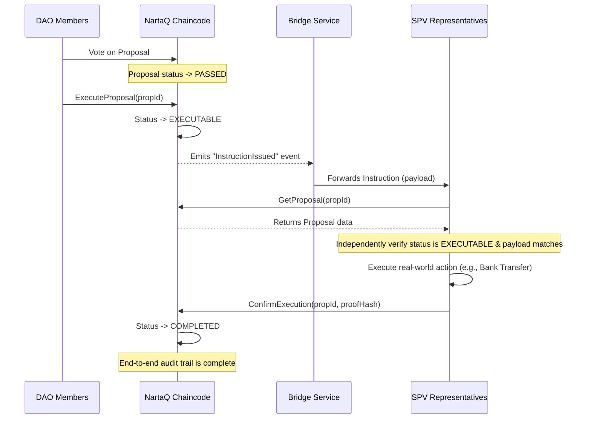

# NartaQ DAO Technical Specification

Version: 0.2 (Implementation Draft - Updated with Security Hardening)
Date: 2025-10-02
Owners: Engineering Team (NartaQ)

This document is a detailed technical specification for the NartaQ DAO protocol and governance token model. For a high‑level overview and rationale.

## Definitions

- DAO: A governed community instance with parameters and member registry.
- Member: Identity with roles and a token balance in a DAO.
- Proposal: A governance item with voting window and thresholds.
- Vote: A cast choice with weight based on member balance (subject to policy).
- DocumentProof: Immutable hash anchoring of off‑chain artifacts related to governance or fundraising.
- FundraisingRound: Fixed‑price capital raise with window and caps.
- ExecutionPayload: A machine‑readable JSON string embedded in a proposal that formally describes the intended off‑chain action.
- PrivateExecutionData: Sensitive fields (e.g., IBAN, personal details) stored in Hyperledger Fabric Private Data Collections, accessible only to authorized organizations.
- SPV Representative: A designated off‑chain operator with role `SPV_REPRESENTATIVE` authorized to file on‑chain proofs of execution. Appointment and revocation subject to DAO governance.
- Compensation request: Implemented as a Proposal containing an `executionPayload` with action `EXECUTE_FIAT_PAYMENT`.
- Time-lock: A mandatory delay period between proposal approval and execution for critical proposal types to prevent governance attacks.
- Dispute Window: A post-execution period during which members can challenge the validity of execution proofs.

## Per-DAO token

Each DAO has its own governance token represented as account balances in world state rather than as a UTXO or external coin. Each DAO defines a TotalSupply and MaxTotalSupply (dilution protection) and maintains an AssignedSupply equal to the sum of member balances. Voting power is token‑weighted by member balance.

Tokens are represented as decimal strings and handled using big.Int arithmetic in chaincode. There is no dust limit; minimums are enforced by chaincode validation rules where relevant (for example, positive amounts for assignments and commitments).

**Token Transferability:** Tokens are **NON-TRANSFERABLE** by default. Member balances can only be modified through governance proposals with explicit administrative actions (e.g., `ASSIGN_TOKENS`, `REVOKE_TOKENS`). This ensures tokens represent voting rights and DAO membership rather than tradable assets. Future phases may introduce optional transferability via DAO policy configuration.

## Wallet

There is no standalone coin wallet. Clients hold Fabric MSP identities (X.509 credentials) to invoke chaincode. The application presents a “wallet” UX that reflects on‑chain balances per DAO member ID. Keys are managed by the MSP/CA; balances are stored on‑chain under `MEMBER:{daoId}:{memberId}`. Recovery and enrollment follow Fabric CA flows (registrar, revocation, reenrollment).

## Validation rules

We inherit Fabric’s endorsement and MVCC validation and add chaincode rules:

- Identity gate: Transactions from identities with attribute `suspended=true` are rejected.
- Numbers: All numeric quantities are decimal strings parsed via big.Int and must be non‑negative.
- Governance: Quorum is evaluated over AssignedSupply. Majority is evaluated over FOR vs (FOR+AGAINST), excluding ABSTAIN. Voting is only valid in [start, end) and when the proposal is in VOTING state.
- Documents: Hashes must be lowercase SHA‑256 hex; document versions are strictly monotonic per (daoId, logicalGroup) with no gaps.
- Fundraising: Window, cap, and single‑commit rules enforced; optional KYC (attribute `kyc.status=APPROVED`) and whitelist (role=INVESTOR) gates.
- Deterministic time: All timestamps and time checks use Fabric TxTimestamp.
- DAO creation must be explicit: First, create the DAO with governance parameters via `CreateDAO`. No auto‑provisioning occurs on first‑write paths.
- Executable instructions: `ExecuteProposal(proposalId)` may be called by anyone but only when the proposal status is PASSED; the transition to EXECUTABLE is idempotent. For critical proposal types (e.g., CHAINCODE_UPGRADE, GOVERNANCE_ROLE_MANAGEMENT), a mandatory time-lock period must elapse before execution.
- Proof of execution: `ConfirmExecution(proposalId, proofOfExecutionHash)` is restricted to identities with role `SPV_REPRESENTATIVE`; proposal must be in EXECUTABLE; `proofOfExecutionHash` must be lowercase SHA‑256 hex. Transitions proposal to COMPLETED and initiates a dispute window.
- Execution failure handling: `ReportExecutionFailure(proposalId, failureReasonHash)` is restricted to identities with role `SPV_REPRESENTATIVE`; proposal must be in EXECUTABLE; transitions to EXECUTION_FAILED state, allowing the DAO to create corrective proposals.
- Dispute mechanism: During the dispute window (e.g., 7 days after COMPLETED), members may create a DISPUTE proposal referencing the completed proposal. If the dispute passes, the original proposal transitions to DISPUTED state for off-chain review.
- Proposal ACLs for execution payloads: Creating a proposal with a non‑empty `executionPayload` requires `DAO_ADMIN` role. Proposals without a payload follow standard DAO_MEMBER rules (as configured by policy).
- ExecutionPayload validation: Chaincode must parse `executionPayload` as JSON and validate required fields for known actions. For `EXECUTE_FIAT_PAYMENT`, require non‑empty `recipientName`, `amount`, and `currency`; sensitive fields (IBAN, personal addresses) must be stored in Private Data Collections with only their hash on-chain; `invoiceReferenceHash` if present must be lowercase SHA‑256 hex; `amount` must be a positive decimal string.
- ExecutionPayload privacy: Sensitive personal data within execution payloads (e.g., IBAN, recipient addresses) **MUST** be stored in Hyperledger Fabric Private Data Collections (PDCs), accessible only to authorized organizations (DAO org and SPV org). The on-chain `executionPayload` contains only a hash of this private data for verifiability.
- SPV Representative governance: Granting or revoking the `SPV_REPRESENTATIVE` role requires a DAO governance proposal of type `GOVERNANCE_ROLE_MANAGEMENT`. This ensures transparent, democratic control over powerful off-chain actors.
- Member suspension governance: Setting a member's `suspended` attribute requires a DAO governance proposal of type `MEMBER_STATUS_UPDATE`. Administrative suspension without governance approval is prohibited.
- Voting window precedence: If `CreateProposal` omits `votingEndsAt`, it is set to `TxTimestamp + dao.votingPeriodDays`. If `votingStartsAt` is omitted, it defaults to `TxTimestamp`. Explicit timestamps must satisfy `votingStartsAt < votingEndsAt` and any policy bounds.
- Execution pause: `ConfirmExecution` requires DAO execution not paused (for example, a `PausedExecution` policy flag is false). Off‑chain systems must perform a just‑in‑time verification of this flag prior to any irreversible action.

## Implementation phases

### Phase 1

- Core governance: DAO, Proposal, Vote, Member
- Document proofs with per‑group versioning
- Fundraising rounds (fixed price): commit window, soft/hard caps, single commitment per investor, finalize to FINALIZED or ABORTED
- **Dilution protection:** `MaxTotalSupply` cap on DAO creation; token assignments cannot exceed this limit
- **Non-transferable tokens:** Balances modifiable only via governance proposals
- **SPV Representative governance:** `GOVERNANCE_ROLE_MANAGEMENT` proposal type for granting/revoking SPV_REPRESENTATIVE role
- **Member suspension governance:** `MEMBER_STATUS_UPDATE` proposal type for suspending/activating members
- **Execution failure handling:** `ReportExecutionFailure` function and `EXECUTION_FAILED` state
- **Privacy:** Private Data Collections for sensitive execution payload data
- Minimal ACLs: suspension gate; DAO_ADMIN required to create fundraising rounds; optional INVESTOR/KYC checks on commit
- Events: AuthDenied, RoundStatusChange, InstructionIssued, ExecutionConfirmed, ExecutionFailed

### Phase 2

- Stronger ACL: enforce DAO_MEMBER/DAO_ADMIN on more governance functions (for example, CreateProposal)
- Proposal categories (including `COMPENSATION`, `GOVERNANCE_ROLE_MANAGEMENT`, `MEMBER_STATUS_UPDATE`) with structured metadata anchored via DocumentProof
- **Dispute window:** Post-execution challenge period for completed proposals via DISPUTE proposal type
- **Time-locks:** Mandatory delay between approval and execution for critical proposal types
- Optional CouchDB enablement with packaged indexes and deterministic selectors
- Event enrichment: ProposalCreated, VoteCast, RoundCreated, CommitmentMade, RoundFinalized, ExecutionDisputed

### Phase 3

- On‑chain policy objects for per‑DAO overrides (quorum, majority, ACL mixins, time-lock periods)
- **Chaincode upgrade governance:** `CHAINCODE_UPGRADE` proposal type with heightened quorum/majority requirements and mandatory time-locks
- **ExecutionPayload schema registry:** Allow DAOs to register new execution payload schemas via governance proposals
- Advanced fundraising (modify/cancel, oversubscription allocation)
- Identity dossier anchoring (hash + URI) for investors/issuers
- Security note: Updates to on‑chain policy objects are critical actions and must go through their own proposal process with heightened quorums (e.g., 75% instead of 51%), mandatory time‑locks (e.g., 7-14 days), and potentially multi-signature requirements to prevent malicious manipulation.

### Phase 4

- Reputation‑aware governance (optional weight adjustments) with auditability
- Multi‑channel routing automation and migration tooling

### Phase 5

- Operational tooling, dashboards, and SIEM integrations
- Cross‑DAO analytics (off‑chain), archival strategies

## Security measurements

- Endorsement policies configurable per environment; sensitive functions may require higher thresholds.
- Suspension attribute gate as a universal pre‑check on state‑changing calls.
- Parameter clamps and input validation for all arithmetic and time windows.
- Deterministic execution: no local clocks or nondeterminism; Fabric TxTimestamp only.
- Event emission for security/audit (AuthDenied, status changes).

## Maturity

Newly assigned tokens can optionally be configured (future policy) with a maturity period before they affect voting weight. Not implemented in Phase 1; can be introduced via a proposal‑driven policy in later phases.

## Limitation of growth of the total supply per epoch

**Phase 1 Implementation:** Each DAO defines a `MaxTotalSupply` at creation that cannot be exceeded. This provides immediate protection against unlimited dilution. Token assignments via proposals must respect this hard cap.

**Future Enhancements (Phase 3+):** DAOs may define additional policy caps limiting net assignment/mint per epoch (for example, per month or per N blocks) to further constrain dilution and reduce risk. These caps can be introduced and configured via policy objects subject to governance.

## Emergency controls (activation key/policy)

Emergency measures are enacted via governance and/or operator policy:

- Feature flags and policy toggles (for example, disable fundraising creation, freeze commitments) through a chaincode upgrade or policy object update.
- Operational kill‑switches outside the ledger must be used conservatively and documented; peers can ignore out‑of‑band signals, keeping the system decentralized. Preferred approach is on‑chain policy.

## Predefined policy for unexpected situations

In the event of defects or abuse:

- Freeze or disable affected flows via policy/feature flags.
- Patch and upgrade chaincode with additive, reversible changes; preserve key prefixes.
- Where feasible, introduce corrective proposals (for example, compensatory token assignments) rather than mutating history.
- For clear violations, governance may adopt policies to quarantine or deprecate affected state in future logic while preserving auditability.

## Voting

Voting is an on‑chain call (`CastVote`) without a reveal phase. Voting weight is derived on‑chain from the voter’s member balance (not supplied by the client). Tally uses AssignedSupply for quorum and excludes ABSTAIN in the majority denominator.

### Vote invocation

`CastVote(proposalId, voteType)` validates window and status, derives the voter identity from the transaction invoker (MSP creator), derives weight from the member’s on‑chain balance, ensures a single vote per voter per proposal, and updates tallies.

### Voting data

Stored per proposal: totalVotes, forVotes, againstVotes, abstainVotes, and per‑vote receipts keyed by `(proposalId, voterId)` to prevent double voting.

## On-Chain Instruction Lifecycle

The proposal process produces a formal, executable instruction instead of relying on ambiguous off‑chain interpretation.

### 1) Enhance Proposal with `ExecutionPayload`

- The `Proposal` struct includes a standardized, machine‑readable payload describing the action to be taken off‑chain.
- Field: `executionPayload` as a JSON string. Example payload for a contractor payment:

```json
{
  "action": "EXECUTE_FIAT_PAYMENT",
  "version": "1.0",
  "details": {
    "recipientName": "Alice Developer",
    "recipientAddress": "123 Main St, Anytown",
    "iban": "DE89370400440532013000",
    "amount": "5000",
    "currency": "USD",
    "invoiceReferenceHash": "a1b2c3d4..."
  }
}
```

### 2) Add `EXECUTABLE` state and `InstructionIssued` event

- When a proposal passes, it does not immediately execute. An explicit call `ExecuteProposal(proposalId)` transitions status to `EXECUTABLE` and emits an `InstructionIssued` event with `{ proposalId, executionPayload }`.
- Anyone may call `ExecuteProposal`. The function verifies the proposal has status PASSED; the transition to EXECUTABLE is idempotent.



### The Off-Chain Bridge and Verification Process

Bridge Service (the messenger):

- A trusted but verifiable off‑chain service listens for `InstructionIssued`.
- On event, it fetches the full proposal from chain and forwards `{proposalId, executionPayload}` to the SPV’s secure system.

Independent verification (SPV’s duty):

1. Receive instruction from the bridge.
2. Using a read‑only peer, call `GetProposal(proposalId)` directly.
3. Verify the proposal status is `EXECUTABLE` and the `executionPayload` matches exactly.
4. Final verification (just‑in‑time): Immediately prior to executing any irreversible off‑chain action, perform a fresh query to confirm the proposal is still `EXECUTABLE` and that no overriding emergency flags (for example, `PausedExecution`) are active for the DAO.
5. Execute the real‑world action.

### Closing the Loop: Proof of Execution

- After completing the action, an identity with role `SPV_REPRESENTATIVE` calls `ConfirmExecution(proposalId, proofOfExecutionHash)`.
- The function requires current status `EXECUTABLE`, records `proofOfExecutionHash`, and transitions status to `COMPLETED`.
- On success, the chaincode emits an `ExecutionConfirmed` event with `{ proposalId, proofOfExecutionHash }` for off‑chain listeners.
- The proof hash should be the lowercase SHA‑256 of the evidence artifact (for example, bank transfer receipt PDF).

## Appendix: Data model and keys

### On-chain structs (summary)

- DAO: id, name, description, tokenSymbol, totalSupply, assignedSupply, quorumPercentage, majorityPercentage, votingPeriodDays, createdAt, PausedFundraising
- Proposal: id, daoId, title, description, proposalType, votingStartsAt, votingEndsAt, quorumPercentage, majorityPercentage, totalVotes, forVotes, againstVotes, abstainVotes, status, executionPayload, proofOfExecutionHash, createdAt
- Member: daoId, memberId, roles[], balance, createdAt
- DocumentProof: id, daoId, logicalGroup, version, hashAlgorithm, hashHex, storagePath, mimeType, sizeBytes, linkedProposalId, uploaderMemberId, createdAt
- FundraisingRound: id, daoId, roundType, status, currency, tokenSymbol, pricePerToken, softCapAmount, hardCapAmount, minCommitment, maxCommitment, allocationSupply, totalCommittedAmount, investorCount, commitStartAt, commitEndAt, governanceProposalId, termsHash, kycRequired, whitelistMode, createdAt
- Commitment: id, roundId, daoId, investorId, amountCommitted, status, signedTermsHash, createdAt

### State transitions (overview)

| Current State | Action                      | Next State | Notes                                         |
| ------------- | --------------------------- | ---------- | --------------------------------------------- |
| PENDING       | Voting period begins        | VOTING     | Automated                                     |
| VOTING        | Vote passes & period ends   | PASSED     |                                               |
| VOTING        | Vote fails or quorum missed | FAILED     |                                               |
| PASSED        | ExecuteProposal()           | EXECUTABLE | Emits InstructionIssued                       |
| EXECUTABLE    | ConfirmExecution()          | COMPLETED  | Emits ExecutionConfirmed                      |
| EXECUTABLE    | CancelExecutableProposal()  | CANCELED   | Emits InstructionCanceled (strict conditions) |

### Composite keys

- DAO~{daoId}
- PROPOSAL~{proposalId}; PROPOSAL_BY_DAO~{daoId}~{proposalId}
- MEMBER~{daoId}~{memberId}; MEMBER_BY_DAO~{daoId}~{memberId}
- DOC~{docId}; DOC_BY_DAO~{daoId}~{docId}; DOC_BY_DAO_GROUP~{daoId}~{group}~{version}; DOC_BY_PROPOSAL~{proposalId}~{docId}
- ROUND~{roundId}; ROUND_BY_DAO~{daoId}~{roundId}
- COMMIT~{roundId}~{investorId}

### Events (current and planned)

- Current: AuthDenied, RoundStatusChange, InstructionIssued, ExecutionConfirmed
- Planned: ProposalCreated, VoteCast, RoundCreated, CommitmentMade, RoundFinalized, InstructionCanceled

### Channels & scale

- Start multi‑tenant per channel; add channels when latency, volume, or policy isolation demands it. Off‑chain routing decides placement and migration anchors are recorded via documents.

### On‑chain emergency and pause controls

- A DAO‑level pause flag governs fundraising operations (create/commit/finalize gates respect `PausedFundraising`). API: `SetFundraisingPaused(daoId, paused)` (DAO_ADMIN).
- Emergency controls are on‑chain (policy flags), not off‑ledger. Privileged updates require DAO_ADMIN and are auditable.
- A DAO‑level execution pause flag (for example, `PausedExecution`) governs instruction execution; `ConfirmExecution` must reject while active, and off‑chain systems must include a just‑in‑time check prior to irreversible actions. Policy may optionally block `ExecuteProposal` while active.

### Composite key delimiter note

- Fabric composite keys are built via the SDK; internal delimiters are managed by Fabric. When documenting conceptual key forms, prefer `~` as a field separator (for example, `MEMBER~{daoId}~{memberId}`) to avoid confusion with IDs that may contain `:`.
